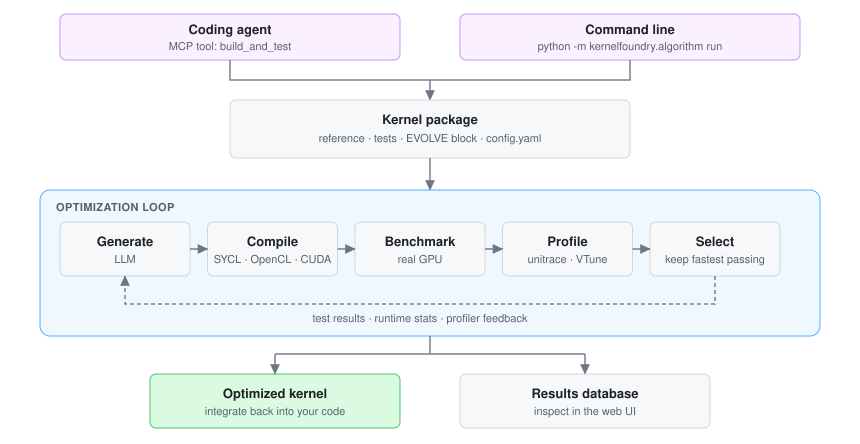

# KernelFoundry


[](https://github.com/isl-org/kernelfoundry/actions/workflows/black.yml)
[](https://pypi.org/project/kernelfoundry/)
[](https://pypi.org/project/kernelfoundry/)
[](https://github.com/isl-org/kernelfoundry/blob/main/LICENSE)

**Write a faster GPU kernel without hand-tuning it.** You supply a reference implementation
and tests that define correctness and speed; KernelFoundry repeatedly generates, compiles,
benchmarks and profiles candidate kernels on real hardware, and keeps the fastest ones that
still pass your tests.

You can drive it two ways: from a **coding agent** in your editor, which packages the kernel
and iterates on real profiler feedback, or from the **command line**, which runs an
evolutionary search (MAP-Elites quality-diversity with meta-prompt evolution) over the design
space. Both target SYCL, OpenCL and CUDA.

<!-- Diagram paths are relative so they resolve against whatever ref is being viewed
     (branch, PR, fork, local preview). Absolute raw/main URLs would 404 until merge. -->
<p align="center">
  <picture>
    <source media="(prefers-color-scheme: dark)" srcset="assets/architecture-dark.svg">
    <source media="(prefers-color-scheme: light)" srcset="assets/architecture-light.svg">
    
  </picture>
</p>

## Core concepts

Four terms are used throughout the docs and the CLI:

- **Task** — one kernel you want to speed up, defined by a reference implementation plus tests.
- **Job** — one run of the optimization on a task. A task can have many jobs (different settings).
- **Kernel package** — the folder you submit: kernel file, reference, tests, and `config.yaml`.
- **EVOLVE block** — the region of the kernel file KernelFoundry is allowed to rewrite, marked
  `[EVOLVE_START]` / `[EVOLVE_END]`. Everything outside it is left untouched.

See [the task format reference](https://github.com/isl-org/kernelfoundry/blob/main/tasks/README.md)
for the full package specification.

## Choose your path

Three ways to use KernelFoundry. Pick one — you don't need the setup for the others.

| I want to… | Use | Jump to |
|---|---|---|
| Optimize a kernel conversationally, from my editor | MCP server + a coding agent | [Optimize from your editor](#optimize-a-kernel-from-your-editor) |
| Run the evolutionary search myself, with full control | Algorithm CLI | [Run the optimization algorithm](#run-the-optimization-algorithm) |
| Just benchmark and validate kernels I already have | Test harness | [Evaluate your own kernels](#evaluate-your-own-kernels) |

## Requirements

| | Editor / MCP | Algorithm CLI | Test harness |
|---|---|---|---|
| Python 3.10+ (3.12 recommended) | ✅ | ✅ | ✅ |
| Install method | `pip install 'kernelfoundry[mcp]'` | **`git clone` required** | `pip install kernelfoundry` |
| GPU | local GPU, or a KernelFoundry server | ✅ | ✅ |
| oneAPI (Intel GPUs) | for local execution | ✅ | ✅ |
| LLM API key | your agent's own model | **✅ required** | — |
| Profiler (unitrace / VTune) | optional | for profiler feedback | optional |

Two requirements catch people out:

- **The algorithm CLI and the web UI need a source clone, not just `pip install`.** The CLI
  resolves its Hydra configs from the repository root, and `start_gui.py` is a repo-root
  script — neither `configs/` nor `start_gui.py` ships inside the installed package.
- **The algorithm calls an LLM, so it needs an API key.** Export `OPENAI_API_KEY`, or
  `ANTHROPIC_API_KEY` if you set `server_type: anthropic`. See
  [Configuring the LLM](#configuring-the-llm).

Supported `gpu_arch` values:

| Vendor | Values |
|---|---|
| Intel (SYCL / OpenCL) | `lnl` (Lunar Lake), `ptl` (Panther Lake), `bmg` (Battlemage), `dg2` (Flex 170 / Arc A770) |
| NVIDIA (CUDA) | `Maxwell`, `Pascal`, `Volta`, `Turing`, `Ampere`, `Hopper`, `Ada`, `native` |

## Installation

### Test harness only

For evaluating kernels you already have:

```bash
pip install kernelfoundry

# If your tasks are based on PyTorch, install torch for your hardware:
# Intel:  pip install torch==2.9.0 --index-url https://download.pytorch.org/whl/xpu
# NVIDIA: pip install torch==2.9.0 --index-url https://download.pytorch.org/whl/cu129
```

### MCP server

For driving KernelFoundry from a coding agent:

```bash
pip install 'kernelfoundry[mcp] @ git+https://github.com/isl-org/kernelfoundry.git'
```

Add `[mcp,algo]` instead if the tool should also run kernels locally rather than submitting
them to a KernelFoundry server.

### Full pipeline (algorithm, UI)

The algorithm CLI and the web UI read configs and scripts from the repository, so start by
cloning it:

```bash
git clone https://github.com/isl-org/kernelfoundry.git
cd kernelfoundry

# Install uv
curl -LsSf https://astral.sh/uv/install.sh | sh
source $HOME/.local/bin/env

# Create and activate a virtual environment with Python 3.12
uv venv --python 3.12
source .venv/bin/activate
uv pip install pip

# Install torch (Intel XPU wheels; use the cu129 index for NVIDIA)
python -m pip install torch==2.9 torchvision==0.24 torchaudio==2.9.0 --index-url https://download.pytorch.org/whl/xpu

# Install all dependencies
uv pip install -e .[all]
```

<details>
<summary><b>Installing the Intel oneAPI toolkit</b> (required to compile SYCL kernels on Intel GPUs)</summary>

```bash
# Download and add the Intel GPG key
wget -O- https://apt.repos.intel.com/intel-gpg-keys/GPG-PUB-KEY-INTEL-SW-PRODUCTS.PUB | \
  gpg --dearmor | sudo tee /usr/share/keyrings/oneapi-archive-keyring.gpg > /dev/null

# Add the Intel oneAPI repository
echo "deb [signed-by=/usr/share/keyrings/oneapi-archive-keyring.gpg] https://apt.repos.intel.com/oneapi all main" | \
  sudo tee /etc/apt/sources.list.d/oneAPI.list

# Install the oneAPI toolkit and VTune
sudo apt update && sudo apt install -y \
    intel-oneapi-base-toolkit-2025.2 \
    intel-oneapi-vtune=2026.1.0-13

# Source the Intel environment (needed in every new shell)
source /opt/intel/oneapi/setvars.sh
```

</details>

<details>
<summary><b>Installing a profiler</b> (optional — enables profiler feedback during optimization)</summary>

Profiler feedback gives the optimizer hardware-level signals instead of timings alone. For
SYCL on Intel GPUs the default is [unitrace](https://github.com/intel/pti-gpu):

```bash
git clone https://github.com/intel/pti-gpu.git
pushd pti-gpu/tools/unitrace
mkdir build
cd build
cmake -DCMAKE_BUILD_TYPE=Release -DBUILD_WITH_MPI=OFF ..
make
popd

# Allow non-root profiling
if [ -f /proc/sys/dev/i915/perf_stream_paranoid ]; then
    sudo sh -c 'echo 0 > /proc/sys/dev/i915/perf_stream_paranoid'
fi
if [ -f /proc/sys/dev/xe/observation_paranoid ]; then
    sudo sh -c 'echo 0 > /proc/sys/dev/xe/observation_paranoid'
fi
```

VTune also works and ships with oneAPI. Enable non-root profiling with:

```bash
if [ -f /proc/sys/kernel/kptr_restrict ]; then
    sudo sh -c 'echo 0 > /proc/sys/kernel/kptr_restrict'
fi
```

VTune is the default profiler for OpenCL. To use it for SYCL, set `profiler_kernel: vtune`
and `profiler_reference: vtune`.

</details>

## Optimize a kernel from your editor

KernelFoundry ships an [MCP](https://modelcontextprotocol.io) server, so any MCP-capable
coding agent — GitHub Copilot, Claude Code, Cursor — can optimize kernels directly in your
editor. It exposes one tool:

**`build_and_test(folder_path)`** — builds and benchmarks the kernel package in that folder,
either locally or on a KernelFoundry server, and returns:

| Field | Meaning |
|---|---|
| `success` | whether the job completed |
| `eval_log` | build errors or test output |
| `runtime_stats` | measured kernel runtimes |
| `speedup` | improvement over the reference |
| `job_id` | job identifier, for looking it up in the UI |

That return value is what makes the loop work: the agent reads the failures and timings,
rewrites the EVOLVE block, and calls the tool again — the cycle in the diagram above, with
your agent in the *Generate* box.

Setup instructions (VS Code and other clients, plus local vs. server execution modes) are in
the [MCP server reference](https://github.com/isl-org/kernelfoundry/blob/main/kernelfoundry/mcp_server/README.md).
You can generate a client config interactively with:

```bash
python -m kernelfoundry.mcp_server create_config
```

For best results, point your agent at
[`AGENTS.md`](https://github.com/isl-org/kernelfoundry/blob/main/AGENTS.md), which describes
the full workflow — packaging a kernel from an existing codebase, validating it, submitting
it, and integrating the result back into your source. Many agents discover that file
automatically.

## Run the optimization algorithm

Requires a clone and an LLM API key (see [Requirements](#requirements)).

```bash
export OPENAI_API_KEY=...   # or ANTHROPIC_API_KEY

# Optimize a KernelBench task
python -m kernelfoundry.algorithm run task=19_ReLU task_origin=KernelBench \
    job_name=my_experiment gpu_arch=lnl language=SYCL

# Optimize your own task
python -m kernelfoundry.algorithm run task=tasks/example_custom task_origin=custom \
    job_name=my_custom_experiment gpu_arch=lnl language=SYCL
```

Common parameters:

| Parameter | Meaning |
|---|---|
| `task` | Path to a task folder, or a KernelBench task ID (e.g. `19_ReLU`) |
| `task_origin` | `KernelBench`, `robust_kbench`, or `custom` |
| `gpu_arch` | Target architecture — see the [table above](#requirements) |
| `language` | `SYCL`, `OpenCL` or `CUDA` (defaults by GPU vendor) |
| `job_name` | Your label for the run; appears in the UI |
| `max_iters` | Optimization iterations (default 3) |
| `branches_per_iteration` | Candidates generated per iteration (default 2) |

See [`configs/run.yaml`](https://github.com/isl-org/kernelfoundry/blob/main/configs/run.yaml)
for every available parameter.

### Configuring the LLM

The generation step calls an LLM API. Set the key for your provider:

```bash
export OPENAI_API_KEY=...      # server_type: openai
export ANTHROPIC_API_KEY=...   # server_type: anthropic
```

Choose the model and provider in
[`configs/inference/server.yaml`](https://github.com/isl-org/kernelfoundry/blob/main/configs/inference/server.yaml),
or use `configs/inference/ensemble.yaml` to sample from several models at once. The models
known to work are listed in `models_avail` at the top of
[`kernelfoundry/algorithm/inference_server.py`](https://github.com/isl-org/kernelfoundry/blob/main/kernelfoundry/algorithm/inference_server.py).

## Evaluate your own kernels

The test harness benchmarks and validates kernels without generating anything — useful for
checking a task definition, or for measuring a kernel you wrote yourself.

1. Create a task test class deriving from `TestBase` (`from kernelfoundry import TestBase`).
2. Implement build logic (optional) and correctness/performance tests — see the
   [task format](https://github.com/isl-org/kernelfoundry/blob/main/tasks/README.md).
3. Compile candidate kernel code with `compile_torch_extension(...)`.
4. Run pytest to validate correctness and collect benchmark timings.

The harness provides:

- A base task interface (`TestBase`) for task-specific build and pytest logic.
- Build helpers for compiling candidates into PyTorch extensions (via Torch or `icpx`).
- Pytest fixtures for correctness and performance runs, and for collecting runtime data.
- Validation helpers (`assert_allclose`, cosine similarity, and related utilities).
- Runtime and machine-info helpers for benchmarking and metadata capture.
- Support for SYCL, OpenCL and CUDA kernels.

To test a kernel through the pipeline without generating a new one, put it in the EVOLVE block
(see [this example](https://github.com/isl-org/kernelfoundry/blob/main/tasks/example_custom/matrix_mul_kernel.sycl))
and run with `validate=true max_iters=0`:

```bash
python -m kernelfoundry.algorithm run task=tasks/example_custom task_origin=custom \
    job_name=my_custom_experiment gpu_arch=lnl language=SYCL validate=true max_iters=0
```

## Results and monitoring

Evaluation runs through a distributed pipeline: candidates are compiled and benchmarked on GPU
workers, profiler feedback is collected, and every candidate is recorded — so a single machine
is not a bottleneck, and nothing measured gets thrown away.

Generated kernels, jobs and metrics are stored in a SQLite database — by default
`runs/kernels.sqlite3`, relative to where you started the run. Change it with
`paths.kernels_db_path`.

> When the MCP server runs in local execution mode under VS Code, the database is written
> relative to your home directory, because that is where the editor launches the server from.

Browse results in the web UI (requires a clone):

```bash
python start_gui.py
```

It serves `http://localhost:8885` and shows:

- Job logs and execution monitoring
- Kernel performance metrics and comparisons
- Optimization progress visualization
- Roofline analysis and performance profiling
- Generated kernel source and metadata

## Troubleshooting

| Symptom | Cause and fix |
|---|---|
| `KeyError: 'OPENAI_API_KEY'` | The algorithm needs an LLM key. Export `OPENAI_API_KEY`, or `ANTHROPIC_API_KEY` with `server_type: anthropic`. |
| `FileNotFoundError: Project root directory not found. Indicators: ['.project-root']` | The algorithm CLI locates its configs by searching upward for the repository root. Run it from inside a clone — a `pip install`-only environment has neither `.project-root` nor `configs/`. |
| `python start_gui.py` — no such file | `start_gui.py` is a repo-root script and is not part of the installed package. Clone the repository. |
| `Unknown architecture gpu_arch: …` | Use a value from the [`gpu_arch` table](#requirements). |
| `gpu_arch must be specified` | Pass `gpu_arch=…` on the command line or set it in the task's `config.yaml`. |
| `Server type … not available` | `server_type` must be `openai` or `anthropic`. |
| MCP: `Missing required config keys` | A `server_url` is set, so `user` and `token` are required too. Provide them via environment variables or `~/.config/kernelfoundry/config.yml`. |
| Profiler permission errors | Enable non-root profiling — see [Installing a profiler](#installation). |
| Invalid keys when merging a task config | Your task's `config.yaml` contains keys absent from `configs/run.yaml`. Usually a typo. |

## Documentation

API documentation is built with Sphinx:

```bash
pip install .[docs]
cd docs
make html
```

Output lands in `docs/_build/html/`. See
[`docs/README.md`](https://github.com/isl-org/kernelfoundry/blob/main/docs/README.md) for
details.

## Contributing

Bug reports and pull requests are welcome via
[GitHub issues](https://github.com/isl-org/kernelfoundry/issues). Code is formatted with
[black](https://github.com/psf/black) (line length 120) and checked in CI.

## License

Apache License 2.0 — see
[LICENSE](https://github.com/isl-org/kernelfoundry/blob/main/LICENSE).

## Citation

If you use KernelFoundry in your research, please cite:

```bibtex
@inproceedings{wiedemann2026kernelfoundry,
  title={KernelFoundry: Hardware-aware evolutionary GPU kernel optimization},
  author={Wiedemann, Nina and Leboutet, Quentin and Paulitsch, Michael and Wofk, Diana and Ummenhofer, Benjamin},
  booktitle={Proceedings of the 41st International Conference on Machine Learning (ICML 2026)},
  year={2026}
}
```
