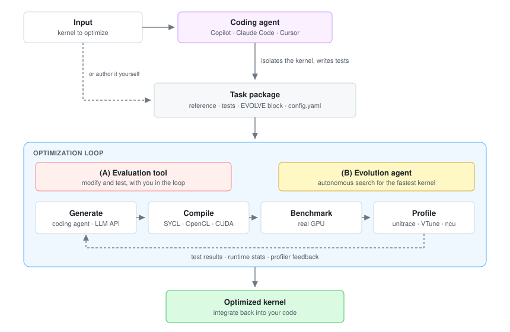
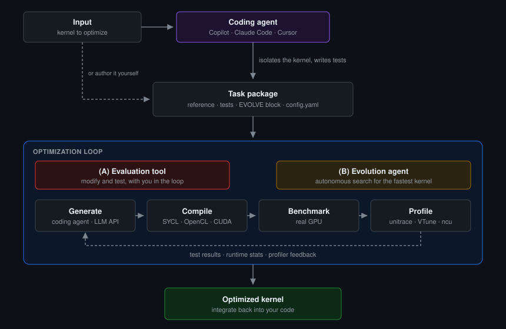

.. kernelfoundry documentation master file

KernelFoundry documentation
===========================

KernelFoundry is an open-source framework for hardware-aware GPU kernel optimization. **Point a
coding agent at a slow GPU kernel and get a faster one back.** The agent isolates the kernel, builds
a reference to beat, finds your existing tests or writes new ones, and derives benchmark sizes from
how the code is actually called, asking you only about what it cannot work out on its own.

From there KernelFoundry repeatedly generates, compiles, benchmarks and profiles candidate kernels on
real hardware, keeping the fastest ones that still pass those tests. On KernelBench it reaches an
speedup of **2.3x** (geometric mean) for SYCL. See the
`paper <https://arxiv.org/abs/2603.12440>`_ for the full evaluation.

You can also author the reference and tests yourself and drive the search from the command line. The
pages below cover both, starting with the agentic path.

         EVOLVE block and config, which you can also author yourself. The task package enters an
         optimization loop, driven either by (A) the evaluation tool in a modify-and-test cycle or
         (B) the evolution agent searching autonomously. The loop generates, compiles, benchmarks on
         a real GPU and profiles candidates, feeding test results, runtime stats and profiler
         feedback back into generation, and emits an optimized kernel to integrate back into your
         code.
   :class: only-light
   :width: 860

         EVOLVE block and config, which you can also author yourself. The task package enters an
         optimization loop, driven either by (A) the evaluation tool in a modify-and-test cycle or
         (B) the evolution agent searching autonomously. The loop generates, compiles, benchmarks on
         a real GPU and profiles candidates, feeding test results, runtime stats and profiler
         feedback back into generation, and emits an optimized kernel to integrate back into your
         code.
   :class: only-dark
   :width: 860

Four terms run through the diagram, the guide and the CLI:

**Task**
   One kernel you want to speed up, defined by a reference implementation plus tests.

**Job**
   One run of the optimization on a task. A task can have many jobs.

**Task package**
   The folder KernelFoundry evaluates: kernel file, reference, tests and ``config.yaml``. The agent
   builds it for you, or you write it yourself. See :doc:`guide/task-package`.

**EVOLVE block**
   The region of the kernel file KernelFoundry may rewrite, marked ``[EVOLVE_START]`` /
   ``[EVOLVE_END]``. Everything outside it is left untouched.

Start here
----------

.. list-table::
   :header-rows: 1
   :widths: 34 66

   * - Go to
     - If you
   * - :doc:`guide/agentic-workflow`
     - Have a slow kernel and want it faster with the least work. Describe it in a sentence and
       a coding agent packages, validates and optimizes it. Start here.
   * - :doc:`guide/quickstart`
     - Would rather drive the search yourself. Runs the shipped example end to end from the
       command line, with no LLM API key. The shipped example is a SYCL kernel for an Intel GPU;
       on NVIDIA, start from the KernelBench task the page gives instead.
   * - :doc:`guide/task-package`
     - Are writing a task package by hand. Continue to :doc:`guide/writing-tests`.
   * - :doc:`guide/config-parameters`
     - Are tuning a run. See also :doc:`guide/optimization-strategies`.
   * - :doc:`guide/understanding-results`
     - Have a finished run and want to know why it went that way.
   * - :doc:`api/public`
     - Are writing tests and need the exact signatures. Assumes you know the package format.

For installation, the `README <https://github.com/isl-org/kernelfoundry#installation>`_ is the
single source of truth.

.. toctree::
   :maxdepth: 2
   :caption: User guide

   guide/agentic-workflow
   guide/quickstart
   guide/task-package
   guide/writing-tests
   guide/config-parameters
   guide/understanding-results
   guide/optimization-strategies

.. toctree::
   :maxdepth: 2
   :caption: API reference

   api/public
   api/modules

Indices and tables
==================

* :ref:`genindex`
* :ref:`modindex`
* :ref:`search`
